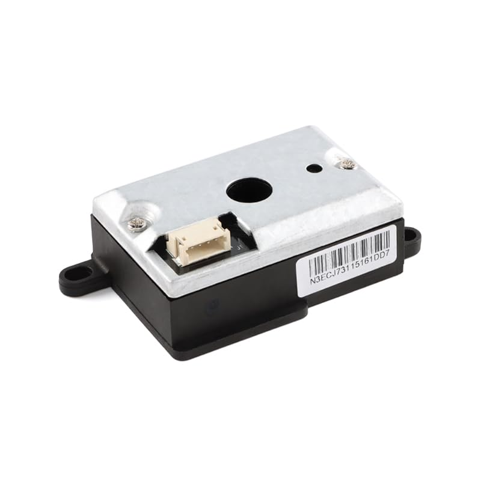
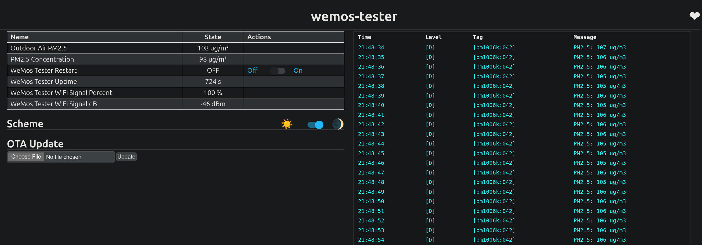

# ESPHome PM1006K / PM1006 Custom Component (Continuous Broadcast Variant)

[](LICENSE)
[](https://esphome.io/)

A custom ESPHome external component for Cubic **PM1006 / PM1006K** optical particle counter sensors that automatically stream **4-byte continuous broadcast frames** over 9600 baud UART, rather than responding to standard query-response requests.

---

## Hardware Overview & Visuals

This component specifically supports the low-cost (~$10 USD) PM2.5 infrared air quality sensor modules commonly found on Amazon and secondary suppliers:

* **Module Specs:** DC01 Infrared PM2.5 Air Quality Sensor Module (Dust Concentration Detection, UART ZH1.5mm 4P interface).
* **Hardware Purchase:** [Amazon Link](https://amzn.to/4yZbrNf) *(Affiliate Link)*

| Sensor Hardware | WeMos D1 Mini Web Server (Working Output) |
| :---: | :---: |
|  |  |
| *DC01 / PM1006K PM2.5 Sensor Module* | *ESPHome live web server output on WeMos D1 Mini* |

---

## Technical Context

Many standard ESPHome implementations for the Cubic PM1006 expect a query-response architecture (where the microcontroller sends a request frame over TX and waits for a multi-byte response over RX). 

However, several hardware revisions—frequently designated as **PM1006K** or secondary revisions of the **PM1006**—broadcast a continuous 4-byte payload once per second without requiring active polling. Using standard query components with these continuous-broadcast revisions often leads to frame header sync failures or checksum mismatches.

### Frame Structure

* **Baud Rate:** 9600 8N1
* **Frame Length:** 4 Bytes
* **Structure:** `[0xA5] [Status] [PM2.5 Raw Value] [Checksum]`
* **Checksum Verification:** 8-bit sum where `(Header + Status + PM2.5 Value) == Checksum`

---

## Pinout & Wiring

The DC01 / PM1006K sensor module uses a 4-pin **ZH1.5mm pitch connector**. Because this variant broadcasts data continuously without waiting for query commands, **only the `TX` pin is required for data transmission**—the sensor's `RX` pin can remain disconnected.

### Sensor Module Pinout

| Pin | Wire Color (Typical) | Label | Function | Notes |
| :---: | :---: | :---: | :--- | :--- |
| **1** | Red | **VCC** | Power Supply | Connect to **5V** (5V DC required for optical fan/sensor) |
| **2** | Black | **GND** | Ground | Common Ground |
| **3** | Yellow / Green | **TX** | Sensor Serial Output | Transmits 9600 baud serial data to Microcontroller RX |
| **4** | White / Blue | **RX** | Sensor Serial Input | **Not generally used** (Continuous broadcast revision does not seem to accept TX queries) |

> ⚠️ **Important Voltage & Power Note:**
> * **Power (VCC):** The sensor requires a **5V** rail to power the internal fan and IR LED properly. Powering it from a 3.3V pin may result in no data broadcast or inaccurate readings.
> * **Logic Levels (TX):** The sensor output logic level is 5V, while you can connect directly to an ESP device it may be wise to either use a logic level shifter or a simple voltage divider.

---

### Recommended Wiring Diagrams

#### 1. WeMos D1 Mini / ESP8266 (Hardware UART)

To use the primary hardware UART (`Serial`) on an ESP8266, connect the sensor to the main hardware RX pin (`GPIO3`). 

| Sensor Pin | WeMos D1 Mini Pin | ESP8266 GPIO |
| :--- | :--- | :--- |
| **VCC** | `5V` (or `VBUS`) | 5V Rail |
| **GND** | `G` | GND |
| **TX** | `RX` | `GPIO3` |
| **RX** | `TX` | `GPIO1` *Not explicitly needed |

*Note: Set `logger: baud_rate: 0` in your ESPHome YAML when using `GPIO3` to prevent log output from interfering with serial data.*

#### 2. ESP32 (Flexible Hardware UART)

ESP32 microcontrollers allow mapping hardware UART to almost any free GPIOs (e.g., UART1 or UART2):

| Sensor Pin | ESP32 Board Pin | Function |
| :--- | :--- | :--- |
| **VCC** | `5V` / `VIN` | 5V Power |
| **GND** | `GND` | Ground |
| **TX** | `GPIO16` (or any free RX pin) | UART RX |
| **RX** | `GPIO17` (or any free TX pin) | UART TX *Not explicitly needed |

## Installation & Configuration

### Option 1: Remote Loading via GitHub (Recommended)

Add this external component directly to your ESPHome node's YAML configuration:

```yaml
logger:
  baud_rate: 0  # Disable logging over hardware UART if using TX/RX pins (GPIO1/GPIO3) on ESP8266

uart:
  id: uart_pm1006
  tx_pin: GPIO1
  rx_pin: GPIO3
  baud_rate: 9600

external_components:
  - source:
      type: git
      url: https://github.com/nightshade00013/PM1006K
    components: [ pm1006k ]

sensor:
  - platform: pm1006k
    pm_2_5:
      name: "Outdoor Air PM2.5"
      id: outdoor_pm25
      filters:
        - throttle_average: 10s
```

### Option 2: Local Component Directory

If you prefer to host the files locally on your ESPHome server, copy the components/pm1006k directory into your /config/esphome/ layout:

```text
esphome/
└── components/
    └── pm1006k/
        ├── __init__.py
        ├── sensor.py
        ├── pm1006k.h
        └── pm1006k.cpp
```
And reference it locally in your YAML:
```yaml
external_components:
  - source:
      type: local
      path: components

sensor:
  - platform: pm1006k
    pm_2_5:
      name: "Outdoor Air PM2.5"
      id: outdoor_pm25
      filters:
        - throttle_average: 10s
```
## AI Assistance & Development Disclaimer

> **Notice regarding automated tooling:**  
> This repository, including its C++ implementation files (`.h`, `.cpp`), Python bindings (`sensor.py`, `__init__.py`), and structural architecture, was developed with assistance from generative artificial intelligence (Gemini / LLM models).

### Verification & Testing

* **Auditing:** All generated code was manually audited, refactored, and compiled against the ESPHome core component framework version 2026.7.2.
* **Hardware Validation:** Hardware functionality and parser reliability have been validated using physical hardware testing (WeMos D1 Mini / ESP8266 paired with a Cubic PM1006 variant) under active UART telemetry monitoring.
* **Operational Stability:** Real-time frame parsing, 8-bit checksum verification, and Home Assistant state synchronization have been confirmed stable with zero dropouts or checksum failures during extended operation.

---

## License

This project is dual-licensed under the **MIT License** and **Apache License, Version 2.0**. You may select, at your option, either license. See the [LICENSE](LICENSE) file for complete details.

---

---

## Support the Mission & Say Thanks

If this component saved you time or made your project easier, there are several ways you can say thank you and support a great cause in the process:

* 🌊 **Subscribe on YouTube:** Check out [MuttMutt Outdoors on YouTube](https://www.youtube.com/@MuttMuttOutdoors). Views, likes, and subscriptions directly help fund our scuba diving programs for young abuse survivors.
* 🛒 **Shop via Amazon:** Bookmark and use our [Amazon Affiliate Link](https://amzn.to/4nsJ43G) when shopping. It costs you nothing extra, but a portion of your purchase goes toward funding dive gear and certification fees.
* 💙 **Learn More & Support Directly:** Visit [DogHouse Diving Foundation](https://www.doghousediving.org/) to learn about our mission of providing free SCUBA diving training to teens and young adults recovering from abuse.

For crypto addresses, direct donation options (PayPal/Venmo), or other ways to support the mission, check out the [Thank You page on MuttMutt.us](https://www.muttmutt.us/your-welcome-here-is-how-you-can-say-thank-you/).

*Do Good Things,*  
**MuttMutt**
